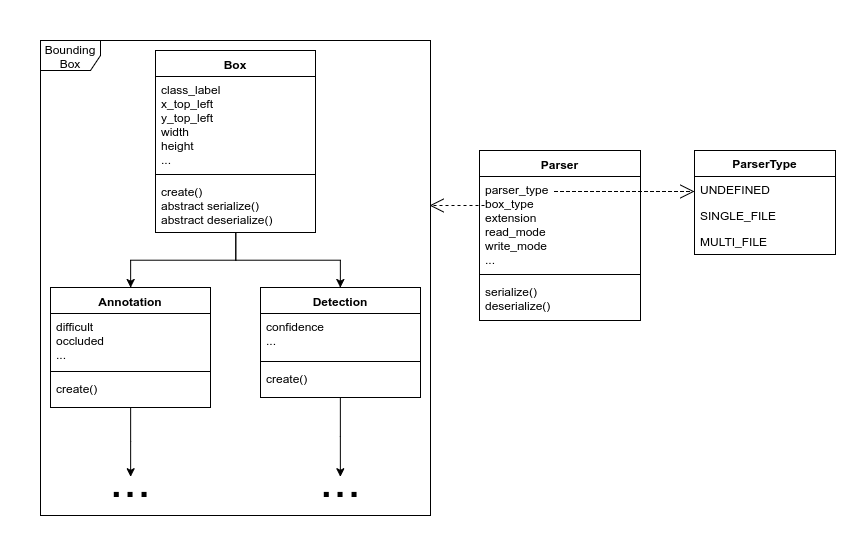

Extending Brambox
=================
Brambox is an open source toolbox. This means that anyone can use it, but also that anyone can add to it.
This page contains a set of guides to help people add tools to this wonderfull toolbox!

Parsers
-------
Parsing annotations and detections being the main purpose of brambox, it is important that people are able to easily add their own parsers.
Because things might not be that straight forward, this guide is here to explain the basic structure.

When creating your own parser, you will create 2 classes, a ``CustomBoundingBox`` and a ``CustomParser``.
Depending on whether you want to parse annotations or detections, your ``CustomBoundingBox`` will override :class:`~brambox.boxes.annotations.Annotation` or :class:`~brambox.boxes.detections.Detection`.
Your ``CustomParser`` will override :class:`~brambox.boxes.box.Parser`.

   UML Diagram of brambox boxes

Your ``CustomBoundingBox`` is a class that represents annotation or detection objects.
It must override the :func:`~brambox.boxes.box.Box.serialize` method to serialize the annotation or detection into a string, bytestream or other type. |br|
The second method that must be overriden is the :func:`~brambox.boxes.box.Box.deserialize` method. In this method you must parse a string, bytestream or other type and set the attributes of the object to the right values.

Your ``CustomParser`` will then perform the actual parsing. It will parse your input string and split it for the different boxes to parse. It is also responsible for concatenating the serialized strings of the individual bounding boxes into one string. |br|
First you must set some class properties to the correct values. Most of them speak for themselves, but the ``parser_type`` might not be entirely clear. This property defines what kind of format this parser is for.
If it is set to :any:`ParserType.SINGLE_FILE <brambox.boxes.box.ParserType.SINGLE_FILE>`, this means the format has one big file that contains all the annotations for every image in the dataset.
If it is set to :any:`ParserType.MULTI_FILE <brambox.boxes.box.ParserType.MULTI_FILE>`, this means the format has one file per image in the dataset. It is important for the :ref:`conversion functions <conversion-label>` to set this property to the correct value. |br|
Then you can also override 2 methods, :func:`~brambox.boxes.box.Parser.serialize` and :func:`~brambox.boxes.box.Parser.deserialize`. 
:func:`~brambox.boxes.box.Parser.deserialize` is responsible for parsing the string from one file.
This means that if you have a :any:`ParserType.MULTI_FILE <brambox.boxes.box.ParserType.MULTI_FILE>`, the parser should return a *list of bounding boxes* for every deserialize call.
If it is a :any:`ParserType.SINGLE_FILE <brambox.boxes.box.ParserType.SINGLE_FILE>`, the parser should return a dictionary containing *image_identifiers* as keys and *lists of bounding boxes* as values.
The default implementation of this method works only for :any:`ParserType.MULTI_FILE <brambox.boxes.box.ParserType.MULTI_FILE>` formats and will simply loop over the lines of the file and :func:`~brambox.boxes.Box.create` bounding boxes for each line.
:func:`~brambox.boxes.box.Parser.serialize` is responsible for generating a string from the bounding boxes of your dataset.
It is basically the opposite of :func:`~brambox.boxes.box.Parser.deserialize`, meaning its input is a *dictionary* or *list* depending on its :class:`~brambox.boxes.box.ParserType`.
The default implementation of this method works by joining the different serialized strings of the bounding boxes with a newline character in between and thus also only works with :any:`ParserType.MULTI_FILE <brambox.boxes.box.ParserType.MULTI_FILE>`.

.. rubric:: Example

>>> # Example annotation parser
>>>
>>> # This contains the classes: Annotation, Parser and ParserType
>>> from brambox.boxes.annotations.annotation import *
>>>
>>> class MyCustomAnnotation(Annotation):
>>>   """ This is my custom annotation type """
>>>
>>>   def serialize(self):
>>>     """ Serialize this annotation into a string, bytestream or ... """
>>>     raise NotImplementedError
>>>
>>>   def deserialize(self):
>>>     """ Parse a string, bytestream or ... into this annotation """
>>>     raise NotImplementedError
>>>
>>>
>>> class MyCustomParser(Parser):
>>>   """ This is my custom parser """
>>>   parser_type = ...             # Select from ParserType.SINGLE_FILE or ParserType.MULTI_FILE
>>>   box_type = MyCustomAnnotation
>>>   extension = ...               # Select proper file extension
>>>   read_mode = ...               # Select proper read mode for opening file. Default = 'r'
>>>   write_mode = ...              # Select proper write mode for opening file. Default = 'w'
>>>
>>>   def serialize(self, boxes):
>>>     """ Serialize boxes into a string, bytestream or ... """
>>>     raise NotImplementedError
>>>
>>>   def deserialize(self, string):
>>>     """ Deserialize string, bytestream or ... into boxes """
>>>     raise NotImplementedError

.. include:: ../links.rst
